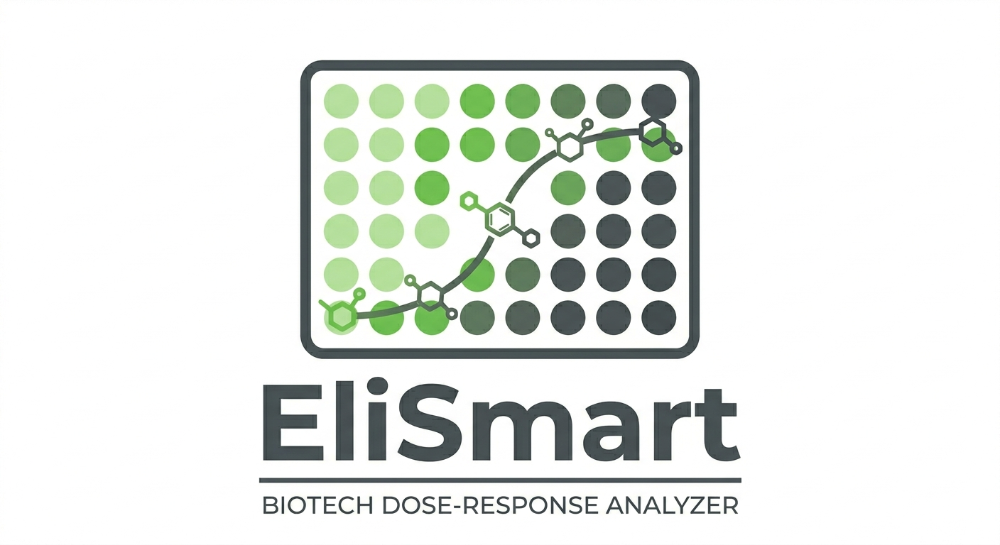

# EliSmart 🧪🔬
### AI-Powered Biotech Dose-Response Analyzer



**EliSmart** is a specialized Laboratory Information Management System (LIMS) designed to streamline the analysis of **ELISA dose-response assays**. Built for scientists and biotechnologists, it transforms raw laboratory data into validated, high-quality insights — from plate reader import to signed Certificate of Analysis — using a robust Java backend, an intuitive Streamlit frontend, and AI-powered analysis.

---

## 🌟 Key Features

* **Protocol-Based Management:** Define reusable assay templates with specific curve-fitting types (4PL, 5PL, 3PL, Linear, Semi-log, Point-to-Point), required reagents, and acceptance criteria (%CV and %Recovery limits).
* **Automated Validation Engine:** The system enforces protocol acceptance criteria automatically. Each measurement pair's %CV and %Recovery are compared against protocol limits — experiments are marked OK or KO programmatically. Manual overrides require a justification stored in the audit trail.
* **4PL Curve Fitting:** Built-in Levenberg-Marquardt optimization fits calibration curves to your standards, interpolates unknown sample concentrations, and calculates %Recovery automatically from raw signal data.
* **Plate Reader CSV Import:** Import raw signal data directly from Tecan, BioTek, Molecular Devices, or generic CSV formats. Map plate layout once, import in seconds — no manual transcription.
* **Replicate Analysis:** Handles Measurement Pairs (duplicates) with server-side calculation of Mean Signal, %CV (ISO 5725 compliant: SD/Mean × 100), and %Recovery.
* **Outlier Detection:** Configurable statistical tests (Grubbs, %Difference threshold) automatically flag outlier pairs. Manual override requires a reason stored in the audit trail.
* **Full Traceability:** Link every experiment to specific reagent Lot Numbers, expiration dates, and sample identities (barcode, matrix, study ID) for complete chain of custody.
* **Per-User Audit Trail:** Every record tracks who created it and who last modified it. Every field change is logged with old value, new value, user, timestamp, and reason. Built on Spring Security with JWT authentication.
* **Role-Based Access Control:** Three roles — Analyst (create/edit), Reviewer (approve/reject), Admin (user management, protocol CRUD) — with endpoint-level enforcement.
* **AI Insights:** Integrated with Google Gemini to provide qualitative analysis of curve anomalies, pipetting errors, lot-specific failures, and cross-experiment trends. Results are persistent and accessible from the experiment detail page.
* **Search & Compare:** Powerful filtering by date, name, or status, with the ability to compare up to four experiments side-by-side with color-coded QC thresholds.
* **Export & Reporting:** PDF Certificate of Analysis with calibration curve plot, color-coded results, and signature block. Excel export for downstream analysis in R, Python, or GraphPad.
* **Reagent Expiry Alerts:** Dashboard alerts for reagent lots expiring within 30, 60, or 90 days.

---

## 🏗️ Tech Stack

* **Backend:** Java 21 with Spring Boot 3.4, Spring Security + JWT
* **Frontend:** Python with Streamlit
* **Database:** H2 (Local/File-based for easy lab deployment)
* **Intelligence:** Google Gemini API via LangChain4j
* **Curve Fitting:** Levenberg-Marquardt (4PL, 5PL, 3PL, Linear, Semi-log, Point-to-Point)
* **Access:** Pinggy (Remote access tunneling)

---

## 📊 Data Model Logic

The system follows a strict hierarchical structure to ensure data integrity:

1. **Protocol:** The "Template" — defines curve type, acceptance criteria, and required reagents.
2. **Experiment:** The "Instance" — a single assay run linked to a protocol, with reagent batches and fitted curve parameters.
3. **MeasurementPair:** The core data unit — duplicate signals with server-calculated mean, %CV, %Recovery, and outlier status.
4. **Sample:** Tracks sample identity (barcode, matrix, patient/study ID) linked to sample-type measurement pairs.
5. **Reagent Catalog → Reagent Batch:** Master data and per-experiment lot traceability.
6. **Audit Log:** Immutable change history for every field modification across all entities.
7. **User:** Authenticated identity with role assignment (Analyst, Reviewer, Admin).

---

## 🚀 Getting Started

**Prerequisites:** Java 21+, Python 3.9+, Maven 3.8+

1. **Clone the repo:**
   ```bash
   git clone https://github.com/saveriocatenate/elismart-lims.git
   cd elismart-lims
   ```

2. **Set environment variables:** copy `.env.example` to `.env` and fill in:
    - `GEMINI_API_KEY` — your Google Gemini API key
    - `JWT_SECRET` — a secure random string for token signing

3. **Build and run the backend:**
   ```bash
   source .env
   ./mvnw clean spring-boot:run
   ```

4. **Configure the frontend:** create `frontend/.streamlit/secrets.toml`:
   ```toml
   backend_url = "http://localhost:8080"
   ```

5. **Run the frontend:**
   ```bash
   cd frontend
   pip install -r requirements.txt
   streamlit run app.py
   ```

6. **Or use the startup script:**
   ```bash
   ./start.sh
   ```
   This launches both backend and frontend and waits for the backend health check before opening the UI.

7. **First login:** An admin user is created on first startup. Credentials are printed in the backend console log. Change the password immediately.

---

## 🔬 Typical Workflow

1. **Admin** creates a Protocol (e.g., "IL-6 ELISA Kit ABC") with 4PL curve type, %CV ≤ 10%, %Recovery 80–120%, and required reagents.
2. **Analyst** creates an Experiment from the protocol. Imports plate reader CSV or enters signals manually. System calculates mean, %CV, fits the curve, interpolates concentrations, and computes %Recovery.
3. **System** runs the Validation Engine: flags outliers, compares each pair against protocol limits, auto-sets status OK or KO.
4. **Analyst** reviews results with color-coded QC indicators. Asks Gemini AI for insights on anomalies.
5. **Reviewer** approves the experiment (status locked, electronic justification logged).
6. **Analyst** exports a PDF Certificate of Analysis for the batch record.

---

## 📁 Project Structure

```
elismart-lims/
├── src/main/java/it/elismart_lims/
│   ├── config/          # Spring config (Security, Gemini, CORS, Logging)
│   ├── security/        # JWT provider, auth filter, UserDetailsService
│   ├── controller/      # REST endpoints
│   ├── service/         # Business logic
│   │   ├── validation/  # ValidationEngine, constants, %CV/%Recovery formulas
│   │   ├── curve/       # CurveFitter interface + implementations (4PL, 5PL, etc.)
│   │   ├── io/          # CsvImportService, PdfReportService, ExcelExportService
│   │   └── audit/       # AuditLogService
│   ├── dto/             # Request/Response records
│   ├── mapper/          # DTO ↔ Entity mappers
│   ├── model/           # JPA entities
│   ├── repository/      # Spring Data JPA interfaces
│   └── exception/       # Custom exceptions + GlobalExceptionHandler
├── src/main/resources/
│   └── db/migration/    # Flyway SQL migrations (V1–V12)
├── src/test/java/       # JUnit 5 + Mockito tests
├── frontend/
│   ├── app.py           # Streamlit entry point
│   ├── pages/           # 11 Streamlit pages
│   ├── utils.py         # Shared utilities
│   └── requirements.txt
├── documentation/       # API contracts, ER diagram, wireframes, validation formulas
├── assets/              # Logo, images
├── start.sh             # One-command startup script
├── CLAUDE.md            # Claude Code development guide
└── README.md
```

---

## 🛡️ Security

- All REST endpoints are protected by JWT Bearer token authentication.
- Passwords are stored as bcrypt hashes.
- Role-based access control (ANALYST, REVIEWER, ADMIN) enforced at endpoint level.
- CORS configured for frontend origin.
- Gemini API key stored in environment variable, never committed.

---

## 📖 Documentation

- `documentation/API.md` — REST API index
- `documentation/API-*.md` — Per-entity endpoint contracts
- `documentation/database-er-diagram.md` — Mermaid ER diagram
- `documentation/frontend-wireframes.md` — Page structure and navigation
- `documentation/validation-formulas.md` — %CV, %Recovery, curve fitting formulas with ISO/CLSI references

---

## 🗺️ Roadmap

- [x] **Phase 1** — Core CRUD, Gemini AI integration, Streamlit frontend
- [ ] **Phase 2** — Authentication, audit trail, RBAC
- [ ] **Phase 3** — Validation engine, curve fitting, outlier detection
- [ ] **Phase 4** — CSV import, PDF/Excel export, Sample entity
- [ ] **Phase 5** — UX polish (QC color coding, inline validation, error handling)
- [ ] **Phase 6** — PostgreSQL migration, electronic signatures, multi-tenancy, compliance docs
- [ ] **Phase 7** — PCR support, SaaS infrastructure, public API

---

## 🛡️ License

This project is licensed under the MIT License - see the [LICENSE](LICENSE) file for details.

---

*Developed with ❤️ for the Biology & Biotech community.*
