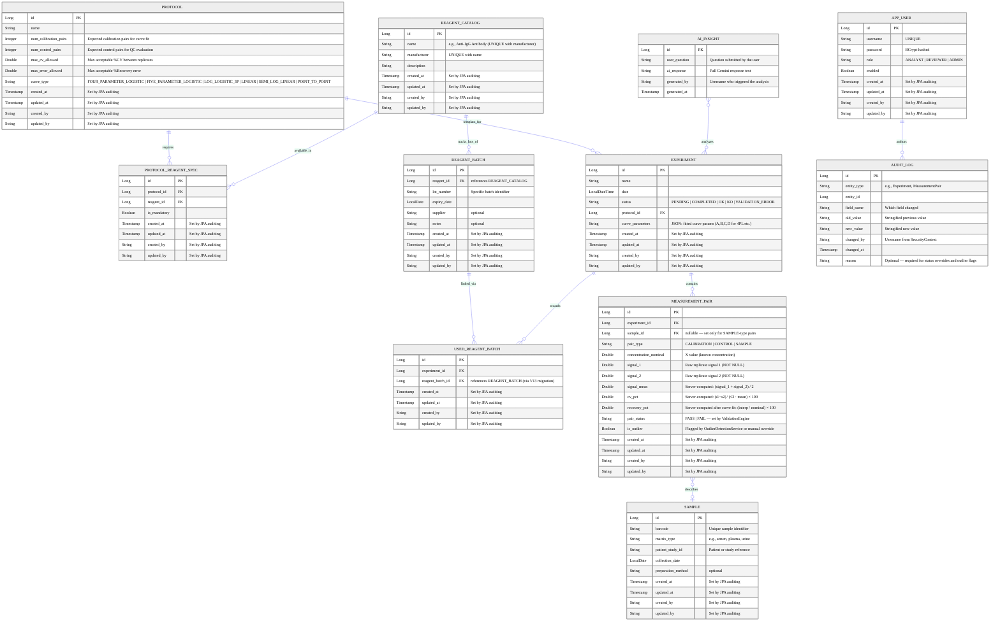

## Schema Notes

- Migrations live in `src/main/resources/db/migration/` (V1–V14).
- `USED_REAGENT_BATCH.reagent_batch_id` replaced the old `reagent_id + lot_number` columns in V12–V13.
- `EXPERIMENT.curve_parameters` stores fitted model coefficients as a JSON string (added in V10).
- All entities extend `Auditable` — `created_at`, `updated_at`, `created_by`, `updated_by` are populated automatically by Spring Data JPA auditing.
- `AUDIT_LOG` has no `updated_at` column — entries are immutable by design.
